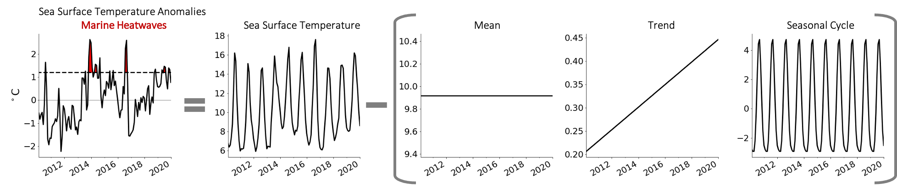
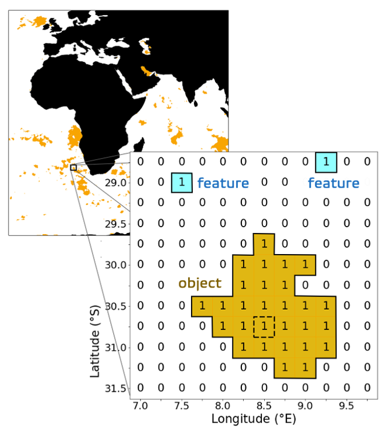
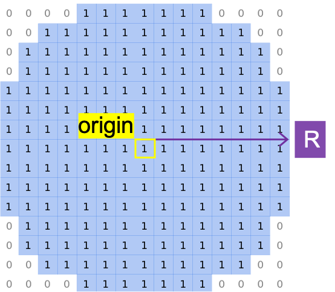
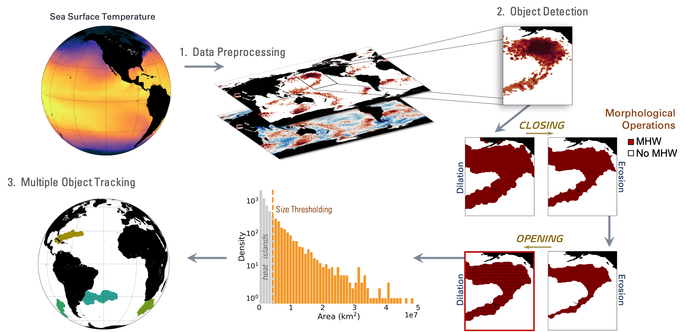

# Background

Marine heatwaves (MHWs) are a type of extreme warming event in the field of oceanography that have gained increased attention since first being described off the coast of Western Australia in 2011 [@Pearce2013]. Qualitatively, MHWs are defined as prolonged and discrete periods of extremely warm sea surface temperatures (SSTs) that cause thermal stress for marine ecosystems [@Hobday2016; @Smale2019]. The consequences range from coral bleaching to mass die-offs of critical marine species, harmful algal blooms, unproductive fisheries, economic loss, and even cross-border tensions [@Cheung2020; @McCabe2016; @Mills2013]. The overall long-lived persistence and large spatial scales of MHWs present several management challenges to protect living marine resources and secure economies [@Pershing2019]. These challenges are further complicated by the anticipation of stronger, longer lasting, and more frequent MHWs occurring as the ocean warms due to increased anthropogenic greenhouse gas emissions [@Frolicher2018; @IPCC2021; @Oliver2019a]. To fully understand the threat of MHWs evolving under future global warming scenarios, a careful inspection of the spatiotemporal connectivity of MHWs is an important prerequisite to link the known physical drivers of MHWs with their time evolving patterns [@Holbrook2020]. 

Detection methods for MHWs are typically based on point-wise thresholding, where the time series of SST at each spatial grid point is separately analyzed [@Oliver2021]. A MHW occurs when SST at a particular location exceeds the local 90th percentile computed over a 30-year fixed climatology [@Hobday2016]. This definition has been applied to globally gridded historical and projected SSTs to assess trends in MHW metrics [@Frolicher2018; @Oliver2018; @Oliver2019a], drivers [@Holbrook2019; @SenGupt2020], and variability [@Oliver2019b]. Once MHWs are detected, their properties (e.g., intensity, duration, and frequency) are often averaged over time and evaluated as composite maps. While these approaches are useful in detecting MHWs locally, they are limited by their inability to characterize the full evolution of spatially connected and discrete events. Knowledge of the spatiotemporal connectivity of MHWs is critical to advance state-of-the-art systems for MHW prediction and forecasting.

# Summary

To overcome the complex spatiotemporal challenges of characterizing MHWs, we present the first known global detection and tracking algorithm for MHWs. By leveraging  morphological operations from multidimensional image processing, `Ocetrac` provides new spatiotemporal metrics that can be probed to explore how observed and simulated events evolve. Applied to over 40 years of observed global SST data, @Scannell20XX use `Ocetrac` to reveal new pathways that connect geographically distant MHWs. The tropical Pacific Ocean acts as a major conduit for extremely persistent and long-lived MHWs genderated by oceanic and atmospheric teleconnections from the tropics to mid-latitudes. The detection algorithm can be tuned using an object boundary smoothing radius that is dependent on the horizontal resolution of the dataset. Additionally, a MHW minimum size thresholding parameter is imposed to filter out small-scale MHWs according to the full area distribution of detected objects. These criteria ensure that only substantially sized MHWs are identified and tracked. @Scannell20XX provide a systematic parameter sensitivity analysis and recommendations for different use cases.  

`Ocetrac` contains a global class called *Tracker* that includes a collection of functions designed to detect, label, track, and characterize MHW objects. The primary algorithms are implemented using the Python programming language as a wrapper around many well-established numeric packages including numpy, xarray, dask, scipy, and scikit-image. A collection of [Jupyter notebooks](https://github.com/ocetrac/ocetrac/tree/main/notebooks) are provided to assist users through the entire workflow.

# Statement of Need

`Ocetrac` is intended to be used as a data processing tool for the extraction of MHW trajectories past, present, and future. It provides many useful metrics such as event size, location, intensity, and duration. We anticipate that these new metrics will be incorporated into machine learning forecasts to predict when and where MHWs are likely to occur, with the intent for operational use in warning vulnerable coastal communities of physical risk. 
While our work focuses on tracking MHWs, the algorithm implemented in `Ocetrac` could be applied to the tracking of any geographically coherent spatiotemporal features.

# Example use case

`Ocetrac` is an analysis routine with several data processing steps. For the purposes of detecting and tracking marine heatwaves, SST anomalies (SSTAs) are calculated by removing the mean, trend, and seasonal cycle at each grid point. The 90th percentile of SSTAs is computed, again at each location, and used as a threshold to identify candidate MHW grid points. 

The preprocessing steps above are performed for the complete time series at each grid point. The resulting maps are transformed into binary images where 1's signify candidate MHW points and 0's signify the background image. The goal is to identify groupings of 1's that define a MHW object and meet specific spatial characteristics in terms of structure and size. 

Object detection is performed using a set of mathematical morphological operations in unique succession (closing then opening). Closing dilates a binary image before eroding it, while opening is the erosion of an image followed by a dilation. These operations are applied using the same structuring element defined by its radius from the origin. The structuring element is used to scan over the entire image to manipulate features based on the dilation and erosion of the image. Erosion eliminates isolated and small features, while dilation fills small holes within larger objects and gradually enlarges the boundaries of the feature region. 

The resulting objects form the initial set of detected MHW objects, which are further eliminated based on their area using a percentile threshold defined from the total size distribution.

The final step in `Ocetrac` involves multiple object tracking. MHWs are defined using a 3D centrosymmetric connectivity element, such that multiple objects that are either adjacent, diagonal, that overlap in time are connected and share a unique ID. There are two possible evolutions: (1) multiple objects merge to form a single event, or (2) a single object splits into multiple objects that retail the ID of the initial object. By design, any objects that have connectivity share an ID, allowing MHWs to contain multiple objects. 

# External libraries used

Data manipulation is conveniently handled using `numpy` [@numpy] and `xarray` [@xarray], and are integrated with `dask` [@dask] when possible, for efficient parallelized computing. The detection algorithm uses a set of morphological operations contained within the `scipy` [@scipy] multidimensional image processing package. Detected objects are labeled and analyzed using the `scikit-image` [@scikit-image] measure module.

# Acknowledgements

Abernathey and Scannell were supported by the Gordon and Betty Moore Foundation grant No. 8434. This is a collaborative project between Columbia University, the National Center for Atmospheric Research (NCAR), National Aeronautics and Space Administration (NASA) Ames Research Center, and the University of Washington. We also received support from the Leonardo DiCaprio Foundation AI for Earth Innovation Grant co-sponsored by Microsoft. 

# References

